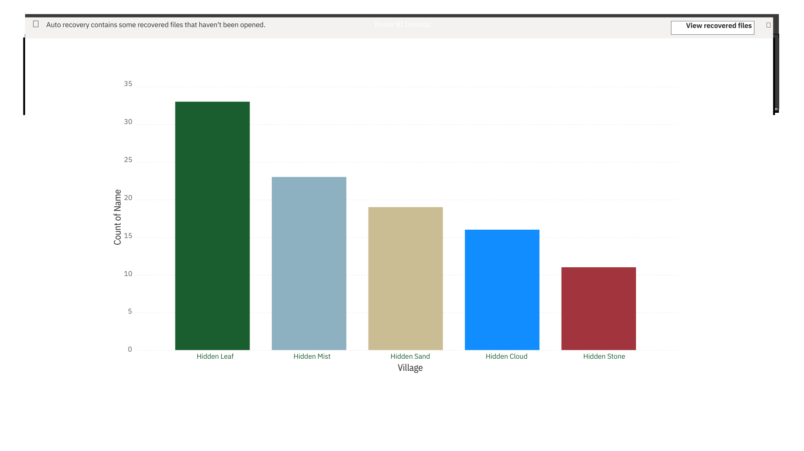

# Naruto Character Representation by Village  

## Goal  
Naruto is a manga created by Masashi Kishimoto, which started in 1999 and ran until 2014. The author was able to create a vast universe with his characters and settings. Naruto, his main character is from an area called the Hidden Leaf village and most of the characters he interacts with are from the said village, there are four other main villages namely the Hidden Sand, Hidden Mist, Hidden Cloud and Hidden Stone, each with their cast of characters who hail from each. I was interested in finding out what village had the most representation in the series (after the Hidden Leaf).

This project aims to determine which village had the most character representation after the Hidden Leaf.

## Process  
1. Dataset Preparation:  
   - Identified and cleaned a dataset of Naruto characters, filling in gaps where some were missing.  
2. Visualization:  
   - Imported the dataset into PowerBi.  
   - Color-coded the characters based on their village for clear visual comparisons.  

## Key Insights  
- The Hidden Leaf Village dominates character representation.  
- The Hidden Mist Village comes in second, a data point slightly skewed by The Seven Swordsmen of Kirikagure.  

## Tools  
- Dataset: Curated from available character databases and cleaned for completeness.  
- PowerBi: Used to create a column chart visualising the village representation in Naruto
